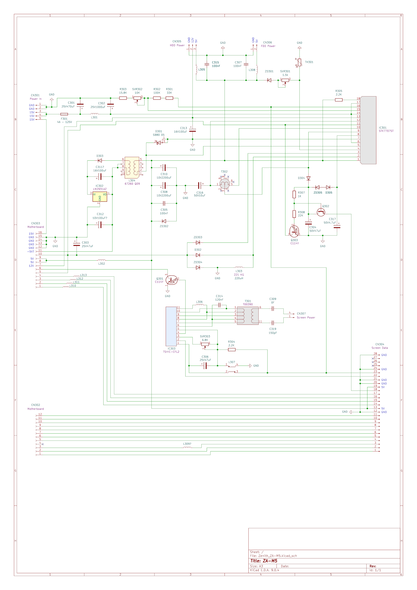

# Zenith ZA-M5 Power Board Schematic

Schematic for the ZA-M5 power board (revision A-4) from my Zenith Data Systems SupersPort SX 386 laptop. 

The project was created / can be opened with [KiCad](https://www.kicad.org/).

Disclaimer
----------

The schematic was created by inspecting a non-working example of the board visually and with a multimeter. It is **not** an original schematic from Zenith. **Some inaccuracies may be present in the schematic.**
